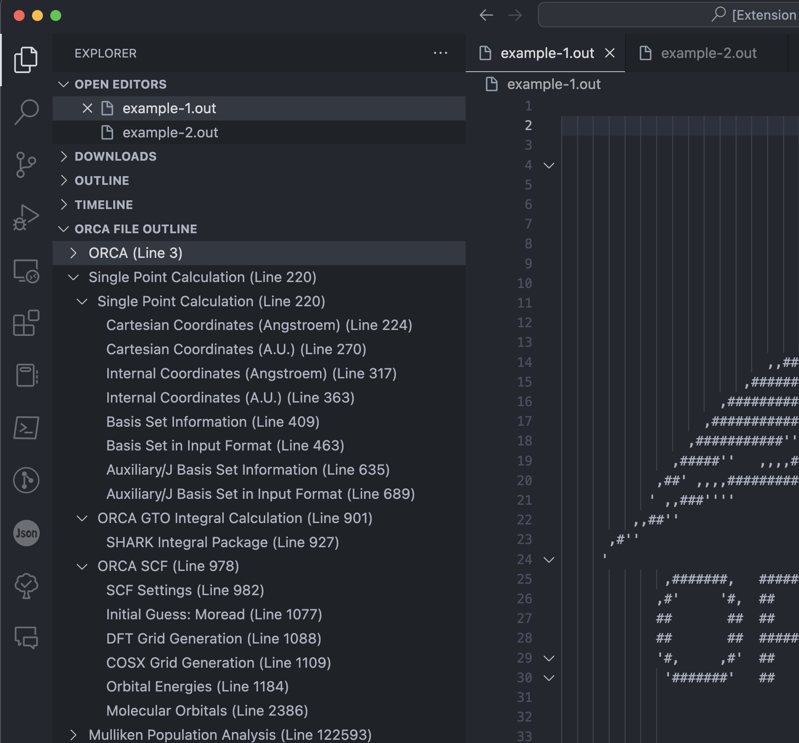
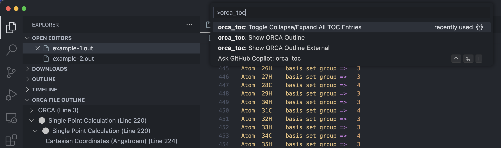

# orcatoc

This an extension for Visual Studio Code that provides a separate toggleable TOC view in the sidebar.

## Features

This extension provides a separate toggleable TOC view in the sidebar. The TOC view can be toggled on and off by clicking on the `ORCA FILE OUTLINE` icon in the sidebar. The TOC view is automatically populated with the contents of the ORCA output file that is currently open in the editor. The TOC view is generated by parsing the ORCA output file using regular expressions and setting up a tree view based on the results.

The generated TOC view is a tree view with the titles of the headings in the ORCA output file and the corresponding line numbers. Clicking on a TOC entry will jump to the corresponding line in the ORCA output file.

By default all the parent entries are collapsed. While navigating through the ORCA output file using the cursor, the TOC view will automatically highlight and expand the corresponding parent entries and highlight the corresponding child entry. Moving the cursor to a different line will automatically update the TOC view by highlighting and expanding the new parent entries and highlighting the new child entry, while collapsing the previous parent entries and removing the highlight from the previous child entry.

The TOC view can also be triggered manually by running the command `orca_toc: Show ORCA Outline` from the command palette. On Windows, the command palette can be opened with `Ctrl+Shift+P`, on Mac it is `Cmd+Shift+P`. The TOC view is automatically updated when navigating to a different ORCA output file, or when an ORCA output file is opened.

The collapsed status of the TOC view could also be changed by clicking the toggle arrow next to each parent entry. The manually changed collapsed status of the TOC view for each ORCA output file will be preserved when navigating between different ORCA output files. To toggle the collapsed status of all the parent entries, please use the command `orca_toc: Toggle Collapse/Expand All TOC Entries` from the command palette.

This plugin also provides syntax highlighting for the ORCA output file, including the headings, separation lines, numbers, and keywords, etc. The display of the syntax highlighting varies with different themes. Dark themes are recommended for better display of the syntax highlighting. To temporarily disable the syntax highlighting, please use the command `Change Language Mode` from the command palette and select `Plain Text`. To switch back to the syntax highlighting, please use the command `Change Language Mode` from the command palette and select `Auto Detect` or `ORCA-output`. Please note that the effect of the syntax highlighting is highly dependent on the theme that you are using. In all the screenshots in this README, the theme used is `One Dark Pro Darker` (See [here](https://marketplace.visualstudio.com/items?itemName=zhuangtongfa.Material-theme) for more details).

## Requirements

N/A

## Extension Settings

Settings of this extension can be changed in the settings of VS Code (click on the gear icon in the bottom left corner of the VS Code window or press `Ctrl+,` on Windows or `Cmd+,` on Mac). The configuration options are listed under `Extensions` -> `ORCA_TOC`, or could be accessed by searching `ORCA_TOC` in the search bar of the settings window.

The current version (0.4.2) enables changing the default status of the toggleable TOC view. The default collapsed status of the TOC view can be changed in the settings of the extension. The default value is `true`, which means that the TOC view is collapsed by default. The TOC view can be expanded by clicking the toggle arrow next to each parent entry.

The current version (0.4.2) enables changing the highlight symbols for the TOC entries. The default highlight symbol is 'circle-large-filled'.
For a list of available highlight symbols, please see [here](https://code.visualstudio.com/api/references/icons-in-labels#icon-listing).

## Issues and Important Notes

- Due to the memory limit of VS Code for large files, could not process files larger than 50MB automatically. This is because the VS Code restricts the size of the `activeEditor` to 50MB, which prevents the extension from getting the contents of the opened ORCA output file. For more details, check the current open issue on Github [#31078](https://github.com/Microsoft/vscode/issues/31078).

- If you have very large ORCA output files, please first consider splitting them into smaller chunks or remove the parts that are not needed (for example full print of the MOs).

- :warning: For large ORCA output files, The current solution is using the `FileSystemProvider` API to read the contents of the ORCA output file directly from the file system. This will allow the extension to parse ORCA output files that are larger than 50MB.  please use the command `orca_toc: Show ORCA Outline External` from the command palette and load the large ORCA output file manually from your file system. The loaded ORCA output file will be displayed in a new tab in the editor of the current VS Code window, with a :lock: symbol at the end of the file name. This is because the file is read-only and cannot be modified. The TOC view will be automatically populated with the contents of this ORCA output file.

- :construction: A known issue is that clicking the heading titles in the `ORCA FILE OUTLINE` view for large ORCA output files will not navigate to the corresponding line in the opened tab. Instead a new tab with the same name file name will pop up, showing identical contents and TOC view at the respective line. This bug will be fixed in a future release.

- :warning: **(Not Recommended!)** Another solution for large ORCA output files is by patching the `workbench.desktop.main.js` file to increase the limit. The default value of `_MODEL_SYNC_LIMIT` is `50 * 1024 * 1024`, which is 50MB. You could change it to a value that is larger than the size of your ORCA output file. This will cause VS Code to display a warining message that the installation is corrupted. Please use this solution at your own risk.

- If you don's see the `ORCA FILE OUTLINE` in the sidebar of `EXPLORER`, please make sure that the `OPEN EDITORS` drop down menu is expanded. This is a known issue and will be fixed in a future release.

## Release Notes

For detailed release notes, please see [CHANGELOG.md](CHANGELOG.md).

### 0.4.2

- update of illustration figures in this README

## TODO

- [x] Highlight the corresponding TOC entry when the user is navigating through the ORCA output file based on the current line number.
- [ ] Foldings feature for the ORCA output file based on the TOC entries.
- [x] Add support for the `ORCA FILE OUTLINE` view to automatically scroll to the current line in the ORCA output file.
- [x] Syntax highliting for the ORCA output file based on the TOC entries.
- [x] Add settings for enabling/disabling the syntax highlighting for the ORCA output file.
- [x] Add command for toggle collapse/expand the TOC view.
- [x] Add option to choose different highlight symbols for the TOC entries
- [ ] Update illustration figures in this README
- [ ] Update the `orca.tmLanguage.json` file to include more syntax definitions for the ORCA output file
- [ ] Update the `patterns.json` file to include more regular expressions for parsing the ORCA output file
- [ ] Update the `keywords.json` file to include more keywords for replacing the matched text

## For Developers

The list of regular expressions is saved in `patterns.json` file. The file contains a list of regular expressions that are used to parse the ORCA output file. Each regular expression is a JSON object with the following properties:

1. `regex`: The regular expression string
2. `level`: The level of the TOC entry (1, 2, 3, etc.)

Please submit a pull request if you would like to add a new regular expression to the list. Please also submit a pull request if you would like to modify an existing regular expression.

A list of keywords that are used to format the headings in the TOC view is saved in `keywords.json` file. The matched strings will be formatted using the corresponding keywords. This list is currently not complete and will be updated in a future release.

The syntax definition for the ORCA output file is saved in [`orca.tmLanguage.json`](syntaxes/orca.tmLanguage.json). The syntax definition is based on the [TextMate grammar](https://macromates.com/manual/en/language_grammars) and [VS Code TextMate grammars](https://code.visualstudio.com/api/language-extensions/syntax-highlight-guide#textmate-grammars). The syntax definition is currently not complete and will be updated in a future release.

Please submit a pull request if you would like to add/modify syntax definitions to the ORCA output file.

## For more information

[ORCA forum](https://orcaforum.kofo.mpg.de/)

[ORCA Input Library](https://sites.google.com/site/orcainputlibrary/home)

**Enjoy!**
